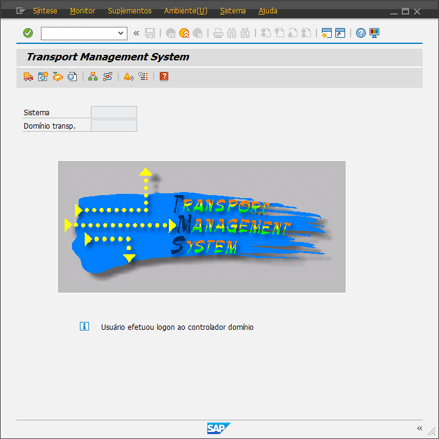

# Run tcode without permission

Imagine a tcode that you can't execute because of your roles/authorizations.

If you have permission to execute Function Modules (SE37 or SE08) you’re good.

***Remember that this is a way to cheat SAP roles/authorizations, use at your own risk.***

Run FM RS_HDSYS_CALL_TC_VARIANT and fill the TCODE you want to execute, then clear the AUTHORITY_CHECK field and execute.

The result is your needed TCODE :)

